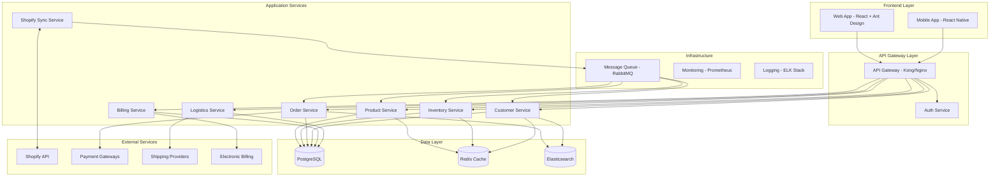

# Design Document

## Overview

Oda implementa una arquitectura de microservicios desacoplada diseñada específicamente para el sector de la moda, combinando capacidades de ERP, CRM y CDP. La arquitectura se basa en principios de Domain-Driven Design (DDD) y Event-Driven Architecture (EDA) para manejar la complejidad del negocio de moda y las integraciones en tiempo real con Shopify.

### Principios Arquitectónicos

- **Separation of Concerns**: Cada dominio del negocio (inventario, clientes, órdenes, facturación) está claramente separado
- **Event-Driven**: Comunicación asíncrona entre servicios mediante eventos
- **API-First**: Todas las funcionalidades expuestas a través de APIs bien definidas
- **Resilience**: Tolerancia a fallos con circuit breakers y fallbacks
- **Scalability**: Escalado horizontal independiente por servicio

## Architecture

### High-Level Architecture



### Technology Stack

#### Frontend Stack

- **Framework**: React 18+ with TypeScript 5+
- **UI Library**: Ant Design 5.x with custom theme
- **State Management**: Redux Toolkit + RTK Query + Immer
- **Form Management**: React Hook Form + Yup validation + Field Arrays
- **Routing**: React Router v6 with lazy loading
- **Build Tool**: Vite 4+ with SWC
- **Styling**: CSS Modules + Styled Components + Ant Design tokens
- **Icons**: Ant Design Icons + Custom SVG icons
- **Charts**: Recharts + D3.js for custom visualizations
- **Date Handling**: Day.js (Ant Design compatible)
- **Internationalization**: React i18next
- **Testing**: Jest + React Testing Library + MSW (Mock Service Worker)
- **E2E Testing**: Playwright
- **Code Quality**: ESLint + Prettier + Husky + lint-staged
- **Bundle Analysis**: Webpack Bundle Analyzer

#### Backend Stack

- **Runtime**: Node.js 18+ LTS with TypeScript 5+
- **Framework**: Express.js 4+ with compression, helmet, cors
- **API Documentation**: OpenAPI 3.0 + Swagger UI + Redoc
- **Validation**: Zod schemas with custom validators
- **ORM**: Prisma 5+ with PostgreSQL connector
- **Authentication**: JWT + Passport.js + bcrypt
- **Authorization**: CASL (isomorphic authorization)
- **File Upload**: Multer + Sharp (image processing)
- **Email**: Nodemailer + email templates
- **Cron Jobs**: node-cron for scheduled tasks
- **Rate Limiting**: express-rate-limit + Redis store
- **Security**: helmet, express-validator, sanitize-html
- **Testing**: Jest + Supertest + Testcontainers
- **Code Quality**: ESLint + Prettier + SonarQube

#### Data Layer

- **Primary Database**: PostgreSQL 15+ with extensions (uuid-ossp, pg_trgm)
- **Cache**: Redis 7+ with Redis Modules (RedisJSON, RedisSearch)
- **Search Engine**: Elasticsearch 8+ with Kibana
- **Message Queue**: RabbitMQ 3.11+ with management plugin
- **File Storage**: AWS S3 compatible (MinIO for development)
- **Database Migrations**: Prisma Migrate
- **Database Seeding**: Prisma Seed with Faker.js
- **Connection Pooling**: PgBouncer
- **Database Monitoring**: pg_stat_statements + pgAdmin

#### External Integrations

- **Shopify**: Shopify Admin API + GraphQL + Webhooks
- **Payment Processing**: Stripe + PayPal + local gateways
- **Shipping**: DHL API + FedEx API + UPS API + local carriers
- **Electronic Billing**: Local tax authority APIs
- **Email Service**: SendGrid + Amazon SES
- **SMS Service**: Twilio + local SMS providers
- **Push Notifications**: Firebase Cloud Messaging
- **Analytics**: Google Analytics 4 + Mixpanel
- **Error Tracking**: Sentry
- **Monitoring**: DataDog + New Relic

#### Infrastructure & DevOps

- **Containerization**: Docker + Docker Compose
- **Orchestration**: Kubernetes (production) + Docker Swarm (staging)
- **API Gateway**: Kong Gateway + Kong Manager
- **Load Balancer**: Nginx + HAProxy
- **Reverse Proxy**: Nginx with SSL termination
- **CDN**: CloudFlare + AWS CloudFront
- **Monitoring**: Prometheus + Grafana + AlertManager
- **Logging**: ELK Stack (Elasticsearch + Logstash + Kibana)
- **Metrics**: StatsD + Grafana dashboards
- **Health Checks**: Custom health endpoints + Kubernetes probes
- **Backup**: pg_dump + Redis RDB + automated S3 backups
- **CI/CD**: GitHub Actions + GitLab CI + ArgoCD
- **Infrastructure as Code**: Terraform + Ansible
- **Secrets Management**: HashiCorp Vault + Kubernetes Secrets
- **SSL Certificates**: Let's Encrypt + cert-manager

#### Development Tools

- **Package Manager**: pnpm (faster than npm/yarn)
- **Monorepo**: Nx or Lerna for multi-package management
- **Code Editor**: VS Code with recommended extensions
- **API Testing**: Postman + Newman (automated testing)
- **Database Client**: DBeaver + pgAdmin
- **Redis Client**: RedisInsight
- **Git Hooks**: Husky + lint-staged + commitizen
- **Documentation**: Storybook + Docusaurus
- **Design System**: Figma + Ant Design tokens
- **Performance**: Lighthouse CI + Web Vitals
- **Security Scanning**: Snyk + OWASP ZAP
- **Dependency Management**: Renovate Bot

## Components and Interfaces

### Core Domain Services

#### Product Service

Manages product catalog, collections, and variants specific to fashion industry.

**Key Responsibilities:**

- Product lifecycle management
- Collection organization
- Variant management (size, color, material)
- Category and attribute management
- Image and media handling

**API Endpoints:**

```typescript
interface ProductAPI {
  // Collections
  GET /api/v1/collections
  POST /api/v1/collections
  PUT /api/v1/collections/:id
  DELETE /api/v1/collections/:id

  // Products
  GET /api/v1/products
  POST /api/v1/products
  PUT /api/v1/products/:id
  DELETE /api/v1/products/:id

  // Variants
  GET /api/v1/products/:id/variants
  POST /api/v1/products/:id/variants
  PUT /api/v1/variants/:id
  DELETE /api/v1/variants/:id
}
```

#### Inventory Service

Real-time inventory management with multi-location support.

**Key Responsibilities:**

- Stock level tracking
- Multi-location inventory
- Reservation management
- Low stock alerts
- Inventory adjustments

**Events Published:**

- `inventory.stock.updated`
- `inventory.low.stock.alert`
- `inventory.reservation.created`

#### Customer Service (CRM/CDP)

Unified customer data platform with 360° customer view.

**Key Responsibilities:**

- Customer profile management
- Segmentation and analytics
- Purchase history tracking
- Loyalty program management
- Customer communication preferences

#### Order Service

Complete order lifecycle management.

**Key Responsibilities:**

- Order creation and processing
- Payment integration
- Order status tracking
- Return and refund management
- Order analytics

#### Shopify Sync Service

Bidirectional synchronization with Shopify.

**Key Responsibilities:**

- Real-time inventory sync
- Product catalog sync
- Order import from Shopify
- Customer data sync
- Webhook processing

**Sync Patterns:**

```typescript
interface SyncService {
  // Push to Shopify
  syncInventoryToShopify(productId: string): Promise<void>
  syncProductToShopify(productId: string): Promise<void>

  // Pull from Shopify
  importOrdersFromShopify(): Promise<void>
  importCustomersFromShopify(): Promise<void>

  // Webhook handlers
  handleShopifyWebhook(event: ShopifyWebhookEvent): Promise<void>
}
```

### Frontend Architecture

#### Atomic Design Structure

Implementamos Atomic Design para crear un sistema de componentes escalable y mantenible:

```
src/
├── components/
│   ├── atoms/                    # Elementos básicos indivisibles
│   │   ├── Button/              # Botones personalizados basados en Ant Design
│   │   ├── Input/               # Inputs con validación
│   │   ├── Label/               # Labels consistentes
│   │   ├── Icon/                # Iconografía del sistema
│   │   ├── Badge/               # Badges de estado
│   │   ├── Avatar/              # Avatares de usuario
│   │   ├── Spinner/             # Loading indicators
│   │   ├── Divider/             # Separadores visuales
│   │   ├── Typography/          # Text, Title, Paragraph
│   │   └── ColorPicker/         # Selector de colores para moda
│   ├── molecules/               # Combinaciones de átomos
│   │   ├── SearchBox/           # Input + Button + Icon
│   │   ├── FormField/           # Label + Input + Error message
│   │   ├── ProductCard/         # Image + Title + Price + Actions
│   │   ├── CustomerInfo/        # Avatar + Name + Contact info
│   │   ├── StatusIndicator/     # Badge + Text + Icon
│   │   ├── PriceDisplay/        # Price + Currency + Discount
│   │   ├── QuantitySelector/    # Input + Increment/Decrement buttons
│   │   ├── ColorSwatch/         # Color picker + Label
│   │   ├── SizeSelector/        # Size options + Selection state
│   │   ├── ImageUploader/       # Upload area + Preview + Actions
│   │   ├── DateRangePicker/     # Start date + End date inputs
│   │   └── FilterChip/          # Removable filter tags
│   ├── organisms/               # Secciones complejas de UI
│   │   ├── ProductGrid/         # Grid de ProductCards + Pagination
│   │   ├── ProductForm/         # Formulario completo de producto
│   │   ├── InventoryTable/      # Tabla con filtros y acciones
│   │   ├── CustomerList/        # Lista con búsqueda y filtros
│   │   ├── OrderSummary/        # Resumen completo de orden
│   │   ├── DashboardStats/      # Métricas y gráficos
│   │   ├── NavigationMenu/      # Menú principal con submenús
│   │   ├── ShoppingCart/        # Carrito con items y totales
│   │   ├── CollectionManager/   # Gestión de colecciones
│   │   ├── VariantMatrix/       # Matriz de variantes (talla/color)
│   │   ├── BulkActions/         # Acciones masivas con selección
│   │   ├── FilterSidebar/       # Panel de filtros avanzados
│   │   └── NotificationCenter/  # Centro de notificaciones
│   ├── templates/               # Layouts de página
│   │   ├── DashboardLayout/     # Layout principal con sidebar
│   │   ├── AuthLayout/          # Layout para login/registro
│   │   ├── ProductLayout/       # Layout específico para productos
│   │   ├── OrderLayout/         # Layout para gestión de órdenes
│   │   ├── CustomerLayout/      # Layout para CRM
│   │   ├── InventoryLayout/     # Layout para inventario
│   │   ├── AnalyticsLayout/     # Layout para reportes
│   │   └── SettingsLayout/      # Layout para configuración
│   └── pages/                   # Páginas completas (templates + data)
│       ├── Dashboard/           # Dashboard principal
│       ├── Products/
│       │   ├── ProductList/     # Lista de productos
│       │   ├── ProductDetail/   # Detalle de producto
│       │   ├── ProductCreate/   # Crear producto
│       │   ├── ProductEdit/     # Editar producto
│       │   ├── Collections/     # Gestión de colecciones
│       │   └── Categories/      # Gestión de categorías
│       ├── Inventory/
│       │   ├── StockLevels/     # Niveles de inventario
│       │   ├── Adjustments/     # Ajustes de inventario
│       │   ├── Transfers/       # Transferencias entre ubicaciones
│       │   └── Reports/         # Reportes de inventario
│       ├── Orders/
│       │   ├── OrderList/       # Lista de órdenes
│       │   ├── OrderDetail/     # Detalle de orden
│       │   ├── OrderCreate/     # Crear orden manual
│       │   ├── Returns/         # Gestión de devoluciones
│       │   └── Fulfillment/     # Cumplimiento de órdenes
│       ├── Customers/
│       │   ├── CustomerList/    # Lista de clientes
│       │   ├── CustomerDetail/  # Perfil de cliente 360°
│       │   ├── Segments/        # Segmentación de clientes
│       │   ├── Loyalty/         # Programa de lealtad
│       │   └── Communications/  # Historial de comunicaciones
│       ├── Analytics/
│       │   ├── Sales/           # Análisis de ventas
│       │   ├── Products/        # Análisis de productos
│       │   ├── Customers/       # Análisis de clientes
│       │   ├── Inventory/       # Análisis de inventario
│       │   └── Shopify/         # Métricas de Shopify
│       ├── Billing/
│       │   ├── Invoices/        # Facturación electrónica
│       │   ├── Payments/        # Gestión de pagos
│       │   ├── TaxSettings/     # Configuración de impuestos
│       │   └── Reports/         # Reportes financieros
│       ├── Logistics/
│       │   ├── Shipping/        # Gestión de envíos
│       │   ├── Carriers/        # Operadores logísticos
│       │   ├── Tracking/        # Seguimiento de paquetes
│       │   └── Returns/         # Logística inversa
│       ├── Shopify/
│       │   ├── Sync/            # Estado de sincronización
│       │   ├── Products/        # Productos en Shopify
│       │   ├── Orders/          # Órdenes de Shopify
│       │   ├── Customers/       # Clientes de Shopify
│       │   └── Settings/        # Configuración de integración
│       ├── Settings/
│       │   ├── General/         # Configuración general
│       │   ├── Users/           # Gestión de usuarios
│       │   ├── Permissions/     # Roles y permisos
│       │   ├── Integrations/    # Configuración de integraciones
│       │   ├── Notifications/   # Configuración de notificaciones
│       │   └── Backup/          # Configuración de respaldos
│       └── Auth/
│           ├── Login/           # Página de login
│           ├── Register/        # Registro de usuario
│           ├── ForgotPassword/  # Recuperar contraseña
│           └── ResetPassword/   # Restablecer contraseña
├── hooks/                       # Custom React hooks
│   ├── useAuth.ts              # Autenticación y autorización
│   ├── useApi.ts               # Llamadas a API con cache
│   ├── useLocalStorage.ts      # Persistencia local
│   ├── useDebounce.ts          # Debouncing para búsquedas
│   ├── useInfiniteScroll.ts    # Scroll infinito para listas
│   ├── useWebSocket.ts         # Conexiones WebSocket
│   ├── useNotifications.ts     # Sistema de notificaciones
│   ├── usePermissions.ts       # Verificación de permisos
│   ├── useShopifySync.ts       # Estado de sincronización
│   ├── useInventoryUpdates.ts  # Actualizaciones de inventario
│   ├── useOrderTracking.ts     # Seguimiento de órdenes
│   └── useAnalytics.ts         # Tracking de eventos
├── services/                    # API service layer
│   ├── api/
│   │   ├── products.ts         # API de productos
│   │   ├── inventory.ts        # API de inventario
│   │   ├── orders.ts           # API de órdenes
│   │   ├── customers.ts        # API de clientes
│   │   ├── billing.ts          # API de facturación
│   │   ├── logistics.ts        # API de logística
│   │   ├── shopify.ts          # API de Shopify
│   │   ├── analytics.ts        # API de analytics
│   │   └── auth.ts             # API de autenticación
│   ├── websocket/
│   │   ├── connection.ts       # Gestión de conexión WS
│   │   ├── events.ts           # Manejo de eventos
│   │   └── subscriptions.ts    # Suscripciones a eventos
│   ├── cache/
│   │   ├── redis.ts            # Cliente Redis
│   │   ├── strategies.ts       # Estrategias de cache
│   │   └── invalidation.ts     # Invalidación de cache
│   └── external/
│       ├── shopify.ts          # Cliente Shopify API
│       ├── payment.ts          # Gateways de pago
│       ├── shipping.ts         # APIs de envío
│       └── billing.ts          # APIs de facturación
├── store/                       # Redux store configuration
│   ├── index.ts                # Store principal
│   ├── middleware.ts           # Middleware personalizado
│   ├── slices/
│   │   ├── auth.ts             # Estado de autenticación
│   │   ├── products.ts         # Estado de productos
│   │   ├── inventory.ts        # Estado de inventario
│   │   ├── orders.ts           # Estado de órdenes
│   │   ├── customers.ts        # Estado de clientes
│   │   ├── ui.ts               # Estado de UI (modals, loading)
│   │   ├── notifications.ts    # Estado de notificaciones
│   │   └── shopify.ts          # Estado de sincronización
│   └── api/
│       ├── baseApi.ts          # RTK Query base API
│       ├── productsApi.ts      # API queries para productos
│       ├── inventoryApi.ts     # API queries para inventario
│       ├── ordersApi.ts        # API queries para órdenes
│       ├── customersApi.ts     # API queries para clientes
│       └── shopifyApi.ts       # API queries para Shopify
├── utils/                       # Utility functions
│   ├── formatters/
│   │   ├── currency.ts         # Formateo de moneda
│   │   ├── date.ts             # Formateo de fechas
│   │   ├── number.ts           # Formateo de números
│   │   └── text.ts             # Formateo de texto
│   ├── validators/
│   │   ├── product.ts          # Validaciones de producto
│   │   ├── customer.ts         # Validaciones de cliente
│   │   ├── order.ts            # Validaciones de orden
│   │   └── common.ts           # Validaciones comunes
│   ├── helpers/
│   │   ├── permissions.ts      # Helpers de permisos
│   │   ├── calculations.ts     # Cálculos de negocio
│   │   ├── transformers.ts     # Transformación de datos
│   │   └── constants.ts        # Constantes de la aplicación
│   └── testing/
│       ├── factories.ts        # Factories para testing
│       ├── mocks.ts            # Mocks para testing
│       └── helpers.ts          # Helpers para testing
├── styles/                      # Estilos globales y temas
│   ├── theme/
│   │   ├── antd.ts             # Customización de Ant Design
│   │   ├── colors.ts           # Paleta de colores
│   │   ├── typography.ts       # Tipografía
│   │   └── spacing.ts          # Sistema de espaciado
│   ├── globals.css             # Estilos globales
│   ├── variables.css           # Variables CSS
│   └── components.css          # Estilos de componentes
├── assets/                      # Assets estáticos
│   ├── images/
│   ├── icons/
│   ├── fonts/
│   └── locales/                # Archivos de internacionalización
├── types/                       # TypeScript type definitions
│   ├── api.ts                  # Tipos de API
│   ├── entities.ts             # Tipos de entidades
│   ├── ui.ts                   # Tipos de UI
│   ├── shopify.ts              # Tipos de Shopify
│   └── global.ts               # Tipos globales
└── config/                      # Configuración
    ├── env.ts                  # Variables de entorno
    ├── api.ts                  # Configuración de API
    ├── theme.ts                # Configuración de tema
    └── constants.ts            # Constantes de configuración
```

#### State Management Strategy

**Redux Toolkit Architecture:**

```typescript
// Store Structure
interface RootState {
  auth: AuthState
  products: ProductsState
  inventory: InventoryState
  orders: OrdersState
  customers: CustomersState
  ui: UIState
  notifications: NotificationsState
  shopify: ShopifyState
}

// Auth Slice
interface AuthState {
  user: User | null
  token: string | null
  permissions: Permission[]
  isLoading: boolean
  error: string | null
}

// Products Slice
interface ProductsState {
  items: Product[]
  selectedProduct: Product | null
  collections: Collection[]
  categories: Category[]
  filters: ProductFilters
  pagination: PaginationState
  isLoading: boolean
  error: string | null
}

// UI Slice for global UI state
interface UIState {
  sidebarCollapsed: boolean
  theme: 'light' | 'dark'
  modals: {
    productCreate: boolean
    orderDetail: boolean
    customerEdit: boolean
  }
  loading: {
    global: boolean
    products: boolean
    inventory: boolean
    orders: boolean
  }
  notifications: Notification[]
}
```

**RTK Query API Structure:**

```typescript
// Base API with authentication
export const baseApi = createApi({
  reducerPath: 'api',
  baseQuery: fetchBaseQuery({
    baseUrl: '/api/v1',
    prepareHeaders: (headers, { getState }) => {
      const token = (getState() as RootState).auth.token
      if (token) {
        headers.set('authorization', `Bearer ${token}`)
      }
      return headers
    },
  }),
  tagTypes: ['Product', 'Inventory', 'Order', 'Customer', 'Collection'],
  endpoints: () => ({}),
})

// Products API
export const productsApi = baseApi.injectEndpoints({
  endpoints: (builder) => ({
    getProducts: builder.query<ProductsResponse, ProductsQuery>({
      query: (params) => ({
        url: 'products',
        params,
      }),
      providesTags: ['Product'],
    }),
    createProduct: builder.mutation<Product, CreateProductRequest>({
      query: (product) => ({
        url: 'products',
        method: 'POST',
        body: product,
      }),
      invalidatesTags: ['Product'],
    }),
    updateInventory: builder.mutation<void, UpdateInventoryRequest>({
      query: ({ productId, ...patch }) => ({
        url: `products/${productId}/inventory`,
        method: 'PATCH',
        body: patch,
      }),
      invalidatesTags: ['Product', 'Inventory'],
    }),
  }),
})
```

**Form State Management:**

```typescript
// React Hook Form with Yup validation
const ProductForm: React.FC = () => {
  const {
    control,
    handleSubmit,
    watch,
    formState: { errors, isSubmitting }
  } = useForm<ProductFormData>({
    resolver: yupResolver(productSchema),
    defaultValues: {
      name: '',
      description: '',
      category: '',
      variants: [{ size: '', color: '', price: 0, sku: '' }]
    }
  })

  const variants = watch('variants')

  return (
    <Form layout="vertical">
      <Controller
        name="name"
        control={control}
        render={({ field }) => (
          <Form.Item
            label="Product Name"
            validateStatus={errors.name ? 'error' : ''}
            help={errors.name?.message}
          >
            <Input {...field} />
          </Form.Item>
        )}
      />
      {/* Dynamic variant fields */}
      <FieldArray
        name="variants"
        control={control}
        render={({ fields, append, remove }) => (
          <>
            {fields.map((field, index) => (
              <VariantFormFields
                key={field.id}
                index={index}
                control={control}
                onRemove={() => remove(index)}
              />
            ))}
            <Button onClick={() => append({ size: '', color: '', price: 0, sku: '' })}>
              Add Variant
            </Button>
          </>
        )}
      />
    </Form>
  )
}
```

#### Component Design Patterns

**Atomic Design Implementation:**

**Atoms - Basic Building Blocks:**

```typescript
// Button Atom with Ant Design extension
interface ButtonProps extends AntButtonProps {
  variant?: 'primary' | 'secondary' | 'danger' | 'ghost'
  size?: 'small' | 'medium' | 'large'
  loading?: boolean
  icon?: React.ReactNode
}

export const Button: React.FC<ButtonProps> = ({
  variant = 'primary',
  size = 'medium',
  children,
  ...props
}) => {
  const buttonClass = `oda-button oda-button--${variant} oda-button--${size}`

  return (
    <AntButton
      className={buttonClass}
      {...props}
    >
      {children}
    </AntButton>
  )
}

// Input Atom with validation
interface InputProps extends AntInputProps {
  label?: string
  error?: string
  required?: boolean
}

export const Input: React.FC<InputProps> = ({
  label,
  error,
  required,
  ...props
}) => {
  return (
    <div className="oda-input-wrapper">
      {label && (
        <Label required={required}>{label}</Label>
      )}
      <AntInput
        status={error ? 'error' : undefined}
        {...props}
      />
      {error && <ErrorMessage>{error}</ErrorMessage>}
    </div>
  )
}
```

**Molecules - Component Combinations:**

```typescript
// Product Card Molecule
interface ProductCardProps {
  product: Product
  onEdit?: (product: Product) => void
  onDelete?: (productId: string) => void
  onViewDetails?: (productId: string) => void
}

export const ProductCard: React.FC<ProductCardProps> = ({
  product,
  onEdit,
  onDelete,
  onViewDetails
}) => {
  return (
    <Card
      className="oda-product-card"
      cover={
        <ProductImage
          src={product.images[0]?.url}
          alt={product.name}
          fallback="/placeholder-product.png"
        />
      }
      actions={[
        <Button
          icon={<EditOutlined />}
          onClick={() => onEdit?.(product)}
          variant="ghost"
        />,
        <Button
          icon={<DeleteOutlined />}
          onClick={() => onDelete?.(product.id)}
          variant="danger"
        />,
        <Button
          icon={<EyeOutlined />}
          onClick={() => onViewDetails?.(product.id)}
          variant="ghost"
        />
      ]}
    >
      <Card.Meta
        title={<Typography.Title level={4}>{product.name}</Typography.Title>}
        description={
          <div className="product-card-details">
            <PriceDisplay
              price={product.price}
              compareAtPrice={product.compareAtPrice}
            />
            <Badge
              count={product.variants.length}
              text="variants"
            />
            <StatusIndicator
              status={product.status}
              text={product.status}
            />
          </div>
        }
      />
    </Card>
  )
}

// Search Box Molecule
interface SearchBoxProps {
  placeholder?: string
  onSearch: (value: string) => void
  onFilter?: () => void
  loading?: boolean
}

export const SearchBox: React.FC<SearchBoxProps> = ({
  placeholder = "Search products...",
  onSearch,
  onFilter,
  loading
}) => {
  const [searchValue, setSearchValue] = useState('')
  const debouncedSearch = useDebounce(searchValue, 300)

  useEffect(() => {
    onSearch(debouncedSearch)
  }, [debouncedSearch, onSearch])

  return (
    <div className="oda-search-box">
      <Input
        placeholder={placeholder}
        value={searchValue}
        onChange={(e) => setSearchValue(e.target.value)}
        prefix={<SearchOutlined />}
        suffix={loading && <Spinner size="small" />}
      />
      {onFilter && (
        <Button
          icon={<FilterOutlined />}
          onClick={onFilter}
          variant="ghost"
        >
          Filters
        </Button>
      )}
    </div>
  )
}
```

**Organisms - Complex UI Sections:**

```typescript
// Product Grid Organism
interface ProductGridProps {
  products: Product[]
  loading?: boolean
  onProductEdit: (product: Product) => void
  onProductDelete: (productId: string) => void
  onProductView: (productId: string) => void
  pagination: PaginationConfig
  onPaginationChange: (page: number, pageSize: number) => void
}

export const ProductGrid: React.FC<ProductGridProps> = ({
  products,
  loading,
  onProductEdit,
  onProductDelete,
  onProductView,
  pagination,
  onPaginationChange
}) => {
  return (
    <div className="oda-product-grid">
      <Spin spinning={loading}>
        <Row gutter={[16, 16]}>
          {products.map(product => (
            <Col xs={24} sm={12} md={8} lg={6} xl={4} key={product.id}>
              <ProductCard
                product={product}
                onEdit={onProductEdit}
                onDelete={onProductDelete}
                onViewDetails={onProductView}
              />
            </Col>
          ))}
        </Row>
      </Spin>

      <div className="product-grid-pagination">
        <Pagination
          current={pagination.current}
          pageSize={pagination.pageSize}
          total={pagination.total}
          showSizeChanger
          showQuickJumper
          showTotal={(total, range) =>
            `${range[0]}-${range[1]} of ${total} products`
          }
          onChange={onPaginationChange}
        />
      </div>
    </div>
  )
}

// Inventory Table Organism
interface InventoryTableProps {
  inventory: InventoryItem[]
  loading?: boolean
  onQuantityUpdate: (itemId: string, quantity: number) => void
  onBulkUpdate: (updates: BulkInventoryUpdate[]) => void
  filters: InventoryFilters
  onFiltersChange: (filters: InventoryFilters) => void
}

export const InventoryTable: React.FC<InventoryTableProps> = ({
  inventory,
  loading,
  onQuantityUpdate,
  onBulkUpdate,
  filters,
  onFiltersChange
}) => {
  const [selectedRowKeys, setSelectedRowKeys] = useState<string[]>([])

  const columns: ColumnsType<InventoryItem> = [
    {
      title: 'Product',
      dataIndex: 'product',
      render: (product: Product) => (
        <div className="inventory-product-cell">
          <Avatar src={product.images[0]?.url} />
          <div>
            <Typography.Text strong>{product.name}</Typography.Text>
            <Typography.Text type="secondary">{product.sku}</Typography.Text>
          </div>
        </div>
      ),
    },
    {
      title: 'Variant',
      dataIndex: 'variant',
      render: (variant: ProductVariant) => (
        <div className="inventory-variant-cell">
          <ColorSwatch color={variant.color} />
          <Typography.Text>{variant.size}</Typography.Text>
        </div>
      ),
    },
    {
      title: 'Current Stock',
      dataIndex: 'quantity',
      render: (quantity: number, record: InventoryItem) => (
        <QuantitySelector
          value={quantity}
          onChange={(newQuantity) => onQuantityUpdate(record.id, newQuantity)}
          min={0}
          status={quantity < record.lowStockThreshold ? 'warning' : 'normal'}
        />
      ),
    },
    {
      title: 'Reserved',
      dataIndex: 'reserved',
      render: (reserved: number) => (
        <Badge count={reserved} showZero />
      ),
    },
    {
      title: 'Available',
      dataIndex: 'available',
      render: (available: number) => (
        <Typography.Text
          type={available <= 0 ? 'danger' : 'success'}
          strong
        >
          {available}
        </Typography.Text>
      ),
    },
    {
      title: 'Last Updated',
      dataIndex: 'updatedAt',
      render: (date: Date) => (
        <Typography.Text type="secondary">
          {formatDistanceToNow(date, { addSuffix: true })}
        </Typography.Text>
      ),
    },
  ]

  return (
    <div className="oda-inventory-table">
      <div className="inventory-table-header">
        <SearchBox
          placeholder="Search inventory..."
          onSearch={(value) => onFiltersChange({ ...filters, search: value })}
        />
        <FilterSidebar
          filters={filters}
          onFiltersChange={onFiltersChange}
        />
        <BulkActions
          selectedCount={selectedRowKeys.length}
          onBulkUpdate={onBulkUpdate}
          disabled={selectedRowKeys.length === 0}
        />
      </div>

      <Table
        columns={columns}
        dataSource={inventory}
        loading={loading}
        rowKey="id"
        rowSelection={{
          selectedRowKeys,
          onChange: setSelectedRowKeys,
        }}
        pagination={{
          showSizeChanger: true,
          showQuickJumper: true,
          showTotal: (total, range) =>
            `${range[0]}-${range[1]} of ${total} items`,
        }}
      />
    </div>
  )
}
```

## Data Models

### Core Entities

#### Product Domain

```typescript
interface Product {
  id: string
  name: string
  description: string
  category: Category
  collections: Collection[]
  variants: ProductVariant[]
  images: ProductImage[]
  attributes: ProductAttribute[]
  shopifyId?: string
  createdAt: Date
  updatedAt: Date
}

interface ProductVariant {
  id: string
  productId: string
  sku: string
  size: string
  color: string
  material?: string
  price: number
  compareAtPrice?: number
  inventoryQuantity: number
  shopifyVariantId?: string
}

interface Collection {
  id: string
  name: string
  description: string
  products: Product[]
  shopifyCollectionId?: string
}
```

#### Customer Domain

```typescript
interface Customer {
  id: string
  email: string
  firstName: string
  lastName: string
  phone?: string
  addresses: CustomerAddress[]
  orders: Order[]
  segments: CustomerSegment[]
  loyaltyPoints: number
  shopifyCustomerId?: string
  createdAt: Date
  updatedAt: Date
}

interface CustomerSegment {
  id: string
  name: string
  criteria: SegmentCriteria
  customers: Customer[]
}
```

#### Order Domain

```typescript
interface Order {
  id: string
  orderNumber: string
  customerId: string
  items: OrderItem[]
  subtotal: number
  tax: number
  shipping: number
  total: number
  status: OrderStatus
  paymentStatus: PaymentStatus
  shippingAddress: Address
  billingAddress: Address
  shopifyOrderId?: string
  createdAt: Date
  updatedAt: Date
}

enum OrderStatus {
  PENDING = 'pending',
  CONFIRMED = 'confirmed',
  PROCESSING = 'processing',
  SHIPPED = 'shipped',
  DELIVERED = 'delivered',
  CANCELLED = 'cancelled',
  RETURNED = 'returned',
}
```

### Database Schema Design

#### PostgreSQL Schema

- **Products & Variants**: Normalized schema with proper indexing
- **Customers**: GDPR-compliant with data retention policies
- **Orders**: Partitioned by date for performance
- **Inventory**: Real-time updates with row-level locking

#### Redis Cache Strategy

- **Product Cache**: TTL 1 hour, invalidate on updates
- **Inventory Cache**: TTL 5 minutes, real-time invalidation
- **Customer Sessions**: TTL based on activity
- **API Response Cache**: TTL varies by endpoint

## Error Handling

### Error Classification

1. **Business Logic Errors**: Validation failures, business rule violations
2. **Integration Errors**: Shopify API failures, payment gateway issues
3. **System Errors**: Database connectivity, service unavailability
4. **User Errors**: Invalid input, unauthorized access

### Error Handling Strategy

#### Frontend Error Handling

```typescript
// Global Error Boundary
class GlobalErrorBoundary extends React.Component {
  componentDidCatch(error: Error, errorInfo: ErrorInfo) {
    // Log to monitoring service
    logger.error('React Error Boundary', { error, errorInfo })

    // Show user-friendly error message
    notification.error({
      message: 'Something went wrong',
      description: 'Please try again or contact support',
    })
  }
}

// API Error Handling
const apiErrorHandler = (error: ApiError) => {
  switch (error.status) {
    case 400:
      // Show validation errors
      break
    case 401:
      // Redirect to login
      break
    case 500:
      // Show generic error message
      break
  }
}
```

#### Backend Error Handling

```typescript
// Global Error Handler
app.use((error: Error, req: Request, res: Response, next: NextFunction) => {
  logger.error('Unhandled Error', { error, req: req.body })

  if (error instanceof ValidationError) {
    return res.status(400).json({
      error: 'Validation Error',
      details: error.details,
    })
  }

  if (error instanceof ShopifyApiError) {
    return res.status(502).json({
      error: 'External Service Error',
      message: 'Shopify integration temporarily unavailable',
    })
  }

  res.status(500).json({
    error: 'Internal Server Error',
    message: 'Something went wrong',
  })
})
```

### Circuit Breaker Pattern

```typescript
class ShopifyCircuitBreaker {
  private failureCount = 0
  private lastFailureTime?: Date
  private state: 'CLOSED' | 'OPEN' | 'HALF_OPEN' = 'CLOSED'

  async execute<T>(operation: () => Promise<T>): Promise<T> {
    if (this.state === 'OPEN') {
      if (this.shouldAttemptReset()) {
        this.state = 'HALF_OPEN'
      } else {
        throw new Error('Circuit breaker is OPEN')
      }
    }

    try {
      const result = await operation()
      this.onSuccess()
      return result
    } catch (error) {
      this.onFailure()
      throw error
    }
  }
}
```

## Testing Strategy

### Testing Pyramid

#### Unit Tests (70%)

- **Frontend**: Component testing with React Testing Library
- **Backend**: Service and utility function testing with Jest
- **Coverage Target**: 80% minimum

#### Integration Tests (20%)

- **API Testing**: Endpoint testing with Supertest
- **Database Testing**: Repository pattern testing
- **External Service Mocking**: Shopify API mocks

#### End-to-End Tests (10%)

- **Critical User Journeys**: Product creation, order processing
- **Cross-browser Testing**: Chrome, Firefox, Safari
- **Mobile Responsive Testing**: Various device sizes

### Test Data Management

```typescript
// Test Data Factory
class TestDataFactory {
  static createProduct(overrides?: Partial<Product>): Product {
    return {
      id: faker.datatype.uuid(),
      name: faker.commerce.productName(),
      description: faker.commerce.productDescription(),
      ...overrides,
    }
  }

  static createCustomer(overrides?: Partial<Customer>): Customer {
    return {
      id: faker.datatype.uuid(),
      email: faker.internet.email(),
      firstName: faker.name.firstName(),
      lastName: faker.name.lastName(),
      ...overrides,
    }
  }
}
```

### Performance Testing

- **Load Testing**: Artillery.js for API endpoints
- **Stress Testing**: Database connection limits
- **Shopify Integration Testing**: Rate limit handling

## Security Architecture

### Authentication & Authorization

#### Multi-Factor Authentication

```typescript
interface AuthenticationFlow {
  // Primary authentication
  login(credentials: LoginCredentials): Promise<AuthResult>

  // MFA support
  enableMFA(userId: string, method: MFAMethod): Promise<MFASetup>
  verifyMFA(token: string, code: string): Promise<boolean>

  // Social login
  socialLogin(
    provider: 'google' | 'facebook',
    token: string
  ): Promise<AuthResult>

  // Password policies
  validatePassword(password: string): PasswordValidationResult
  resetPassword(email: string): Promise<void>
}

// Role-based access control
interface RBACSystem {
  roles: {
    SUPER_ADMIN: Permission[]
    ADMIN: Permission[]
    MANAGER: Permission[]
    EMPLOYEE: Permission[]
    VIEWER: Permission[]
  }

  permissions: {
    PRODUCTS_CREATE: 'products:create'
    PRODUCTS_READ: 'products:read'
    PRODUCTS_UPDATE: 'products:update'
    PRODUCTS_DELETE: 'products:delete'
    INVENTORY_MANAGE: 'inventory:manage'
    ORDERS_PROCESS: 'orders:process'
    CUSTOMERS_MANAGE: 'customers:manage'
    BILLING_ACCESS: 'billing:access'
    ANALYTICS_VIEW: 'analytics:view'
    SETTINGS_MANAGE: 'settings:manage'
  }
}
```

#### API Security

```typescript
// Rate limiting configuration
const rateLimitConfig = {
  windowMs: 15 * 60 * 1000, // 15 minutes
  max: 100, // limit each IP to 100 requests per windowMs
  message: 'Too many requests from this IP',
  standardHeaders: true,
  legacyHeaders: false,
}

// JWT configuration
const jwtConfig = {
  secret: process.env.JWT_SECRET,
  expiresIn: '1h',
  refreshTokenExpiresIn: '7d',
  issuer: 'oda-erp',
  audience: 'oda-users',
}

// CORS configuration
const corsConfig = {
  origin: process.env.ALLOWED_ORIGINS?.split(',') || ['http://localhost:3000'],
  credentials: true,
  optionsSuccessStatus: 200,
}
```

### Data Protection

#### Encryption Strategy

- **Data at Rest**: AES-256 encryption for sensitive data
- **Data in Transit**: TLS 1.3 for all communications
- **Database**: Transparent Data Encryption (TDE) for PostgreSQL
- **File Storage**: Server-side encryption for S3-compatible storage
- **Secrets**: HashiCorp Vault for secrets management

#### GDPR Compliance

```typescript
interface GDPRCompliance {
  // Right to be forgotten
  deleteCustomerData(customerId: string): Promise<void>

  // Data portability
  exportCustomerData(customerId: string): Promise<CustomerDataExport>

  // Consent management
  updateConsent(customerId: string, consent: ConsentSettings): Promise<void>

  // Data retention
  scheduleDataRetention(dataType: string, retentionPeriod: number): void

  // Audit logging
  logDataAccess(userId: string, dataType: string, action: string): void
}
```

## Performance & Scalability

### Caching Strategy

#### Multi-Level Caching

```typescript
// Application-level caching
class CacheManager {
  private redis: Redis
  private memoryCache: NodeCache

  async get<T>(key: string): Promise<T | null> {
    // L1: Memory cache (fastest)
    let value = this.memoryCache.get<T>(key)
    if (value) return value

    // L2: Redis cache
    const redisValue = await this.redis.get(key)
    if (redisValue) {
      value = JSON.parse(redisValue)
      this.memoryCache.set(key, value, 300) // 5 min TTL
      return value
    }

    return null
  }

  async set<T>(key: string, value: T, ttl: number): Promise<void> {
    // Set in both caches
    this.memoryCache.set(key, value, ttl)
    await this.redis.setex(key, ttl, JSON.stringify(value))
  }

  async invalidate(pattern: string): Promise<void> {
    // Invalidate memory cache
    this.memoryCache.flushAll()

    // Invalidate Redis cache
    const keys = await this.redis.keys(pattern)
    if (keys.length > 0) {
      await this.redis.del(...keys)
    }
  }
}

// Cache strategies by data type
const cacheStrategies = {
  products: { ttl: 3600, strategy: 'write-through' }, // 1 hour
  inventory: { ttl: 300, strategy: 'write-behind' }, // 5 minutes
  customers: { ttl: 1800, strategy: 'write-through' }, // 30 minutes
  orders: { ttl: 600, strategy: 'write-through' }, // 10 minutes
  analytics: { ttl: 7200, strategy: 'lazy-loading' }, // 2 hours
}
```

#### Database Optimization

```sql
-- Indexing strategy for PostgreSQL
CREATE INDEX CONCURRENTLY idx_products_category_status
ON products (category_id, status)
WHERE status = 'active';

CREATE INDEX CONCURRENTLY idx_inventory_product_location
ON inventory (product_id, location_id);

CREATE INDEX CONCURRENTLY idx_orders_customer_date
ON orders (customer_id, created_at DESC);

CREATE INDEX CONCURRENTLY idx_customers_email_gin
ON customers USING gin(email gin_trgm_ops);

-- Partitioning for large tables
CREATE TABLE orders_2024 PARTITION OF orders
FOR VALUES FROM ('2024-01-01') TO ('2025-01-01');

-- Materialized views for analytics
CREATE MATERIALIZED VIEW daily_sales_summary AS
SELECT
  DATE(created_at) as sale_date,
  COUNT(*) as order_count,
  SUM(total) as total_revenue,
  AVG(total) as avg_order_value
FROM orders
WHERE status = 'completed'
GROUP BY DATE(created_at);
```

### Horizontal Scaling

#### Microservices Scaling

```yaml
# Kubernetes deployment example
apiVersion: apps/v1
kind: Deployment
metadata:
  name: product-service
spec:
  replicas: 3
  selector:
    matchLabels:
      app: product-service
  template:
    metadata:
      labels:
        app: product-service
    spec:
      containers:
        - name: product-service
          image: oda/product-service:latest
          ports:
            - containerPort: 3000
          env:
            - name: DATABASE_URL
              valueFrom:
                secretKeyRef:
                  name: db-secret
                  key: url
          resources:
            requests:
              memory: '256Mi'
              cpu: '250m'
            limits:
              memory: '512Mi'
              cpu: '500m'
          livenessProbe:
            httpGet:
              path: /health
              port: 3000
            initialDelaySeconds: 30
            periodSeconds: 10
          readinessProbe:
            httpGet:
              path: /ready
              port: 3000
            initialDelaySeconds: 5
            periodSeconds: 5
---
apiVersion: v1
kind: Service
metadata:
  name: product-service
spec:
  selector:
    app: product-service
  ports:
    - port: 80
      targetPort: 3000
  type: ClusterIP
```

## Monitoring & Observability

### Application Monitoring

#### Metrics Collection

```typescript
// Custom metrics with Prometheus
import { register, Counter, Histogram, Gauge } from 'prom-client'

export const metrics = {
  // HTTP request metrics
  httpRequestDuration: new Histogram({
    name: 'http_request_duration_seconds',
    help: 'Duration of HTTP requests in seconds',
    labelNames: ['method', 'route', 'status_code'],
    buckets: [0.1, 0.3, 0.5, 0.7, 1, 3, 5, 7, 10],
  }),

  // Business metrics
  productsCreated: new Counter({
    name: 'products_created_total',
    help: 'Total number of products created',
  }),

  ordersProcessed: new Counter({
    name: 'orders_processed_total',
    help: 'Total number of orders processed',
    labelNames: ['status'],
  }),

  inventoryLevels: new Gauge({
    name: 'inventory_levels',
    help: 'Current inventory levels',
    labelNames: ['product_id', 'location'],
  }),

  shopifySyncStatus: new Gauge({
    name: 'shopify_sync_status',
    help: 'Shopify synchronization status',
    labelNames: ['sync_type'],
  }),
}

// Middleware for HTTP metrics
export const metricsMiddleware = (
  req: Request,
  res: Response,
  next: NextFunction
) => {
  const start = Date.now()

  res.on('finish', () => {
    const duration = (Date.now() - start) / 1000
    metrics.httpRequestDuration
      .labels(
        req.method,
        req.route?.path || req.path,
        res.statusCode.toString()
      )
      .observe(duration)
  })

  next()
}
```

#### Health Checks

```typescript
// Comprehensive health check system
interface HealthCheck {
  name: string
  status: 'healthy' | 'unhealthy' | 'degraded'
  message?: string
  responseTime?: number
  timestamp: Date
}

class HealthCheckService {
  async checkDatabase(): Promise<HealthCheck> {
    const start = Date.now()
    try {
      await prisma.$queryRaw`SELECT 1`
      return {
        name: 'database',
        status: 'healthy',
        responseTime: Date.now() - start,
        timestamp: new Date(),
      }
    } catch (error) {
      return {
        name: 'database',
        status: 'unhealthy',
        message: error.message,
        responseTime: Date.now() - start,
        timestamp: new Date(),
      }
    }
  }

  async checkRedis(): Promise<HealthCheck> {
    const start = Date.now()
    try {
      await redis.ping()
      return {
        name: 'redis',
        status: 'healthy',
        responseTime: Date.now() - start,
        timestamp: new Date(),
      }
    } catch (error) {
      return {
        name: 'redis',
        status: 'unhealthy',
        message: error.message,
        responseTime: Date.now() - start,
        timestamp: new Date(),
      }
    }
  }

  async checkShopify(): Promise<HealthCheck> {
    const start = Date.now()
    try {
      const response = await shopifyClient.shop.get()
      return {
        name: 'shopify',
        status: response ? 'healthy' : 'degraded',
        responseTime: Date.now() - start,
        timestamp: new Date(),
      }
    } catch (error) {
      return {
        name: 'shopify',
        status: 'degraded', // Shopify issues shouldn't kill the app
        message: error.message,
        responseTime: Date.now() - start,
        timestamp: new Date(),
      }
    }
  }

  async getOverallHealth(): Promise<{
    status: 'healthy' | 'unhealthy' | 'degraded'
    checks: HealthCheck[]
    uptime: number
  }> {
    const checks = await Promise.all([
      this.checkDatabase(),
      this.checkRedis(),
      this.checkShopify(),
    ])

    const hasUnhealthy = checks.some((check) => check.status === 'unhealthy')
    const hasDegraded = checks.some((check) => check.status === 'degraded')

    let status: 'healthy' | 'unhealthy' | 'degraded'
    if (hasUnhealthy) status = 'unhealthy'
    else if (hasDegraded) status = 'degraded'
    else status = 'healthy'

    return {
      status,
      checks,
      uptime: process.uptime(),
    }
  }
}
```

### Logging Strategy

#### Structured Logging

```typescript
// Winston logger configuration
import winston from 'winston'
import { ElasticsearchTransport } from 'winston-elasticsearch'

const logger = winston.createLogger({
  level: process.env.LOG_LEVEL || 'info',
  format: winston.format.combine(
    winston.format.timestamp(),
    winston.format.errors({ stack: true }),
    winston.format.json()
  ),
  defaultMeta: {
    service: 'oda-erp',
    version: process.env.APP_VERSION,
    environment: process.env.NODE_ENV,
  },
  transports: [
    // Console transport for development
    new winston.transports.Console({
      format: winston.format.combine(
        winston.format.colorize(),
        winston.format.simple()
      ),
    }),

    // File transport for production
    new winston.transports.File({
      filename: 'logs/error.log',
      level: 'error',
    }),
    new winston.transports.File({
      filename: 'logs/combined.log',
    }),

    // Elasticsearch transport for centralized logging
    new ElasticsearchTransport({
      level: 'info',
      clientOpts: {
        node: process.env.ELASTICSEARCH_URL,
      },
      index: 'oda-logs',
    }),
  ],
})

// Request logging middleware
export const requestLogger = (
  req: Request,
  res: Response,
  next: NextFunction
) => {
  const start = Date.now()

  res.on('finish', () => {
    const duration = Date.now() - start
    logger.info('HTTP Request', {
      method: req.method,
      url: req.url,
      statusCode: res.statusCode,
      duration,
      userAgent: req.get('User-Agent'),
      ip: req.ip,
      userId: req.user?.id,
    })
  })

  next()
}
```

## Deployment Architecture

### Environment Configuration

#### Development Environment

```yaml
# docker-compose.dev.yml
version: '3.8'
services:
  app:
    build:
      context: .
      dockerfile: Dockerfile.dev
    ports:
      - '3000:3000'
    environment:
      - NODE_ENV=development
      - DATABASE_URL=postgresql://postgres:password@db:5432/oda_dev
      - REDIS_URL=redis://redis:6379
    volumes:
      - .:/app
      - /app/node_modules
    depends_on:
      - db
      - redis
      - elasticsearch

  db:
    image: postgres:15
    environment:
      POSTGRES_DB: oda_dev
      POSTGRES_USER: postgres
      POSTGRES_PASSWORD: password
    ports:
      - '5432:5432'
    volumes:
      - postgres_data:/var/lib/postgresql/data

  redis:
    image: redis:7-alpine
    ports:
      - '6379:6379'

  elasticsearch:
    image: elasticsearch:8.8.0
    environment:
      - discovery.type=single-node
      - xpack.security.enabled=false
    ports:
      - '9200:9200'
    volumes:
      - elasticsearch_data:/usr/share/elasticsearch/data

volumes:
  postgres_data:
  elasticsearch_data:
```

#### Production Environment

```yaml
# kubernetes/production/deployment.yml
apiVersion: apps/v1
kind: Deployment
metadata:
  name: oda-erp
  namespace: production
spec:
  replicas: 5
  strategy:
    type: RollingUpdate
    rollingUpdate:
      maxSurge: 2
      maxUnavailable: 1
  selector:
    matchLabels:
      app: oda-erp
  template:
    metadata:
      labels:
        app: oda-erp
    spec:
      containers:
        - name: oda-erp
          image: oda/erp:latest
          ports:
            - containerPort: 3000
          env:
            - name: NODE_ENV
              value: 'production'
            - name: DATABASE_URL
              valueFrom:
                secretKeyRef:
                  name: oda-secrets
                  key: database-url
            - name: REDIS_URL
              valueFrom:
                secretKeyRef:
                  name: oda-secrets
                  key: redis-url
          resources:
            requests:
              memory: '512Mi'
              cpu: '500m'
            limits:
              memory: '1Gi'
              cpu: '1000m'
          livenessProbe:
            httpGet:
              path: /health
              port: 3000
            initialDelaySeconds: 60
            periodSeconds: 30
          readinessProbe:
            httpGet:
              path: /ready
              port: 3000
            initialDelaySeconds: 10
            periodSeconds: 10
```
